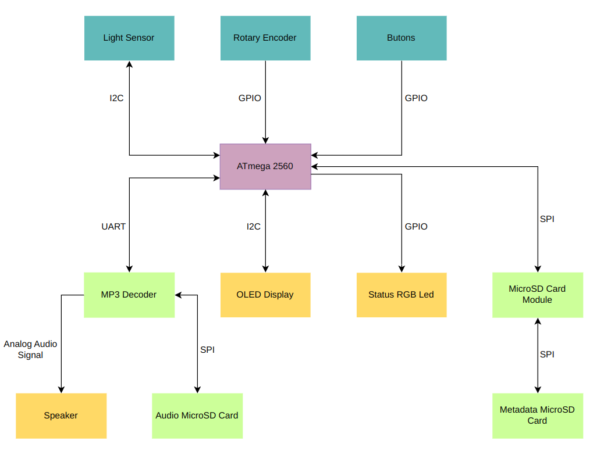
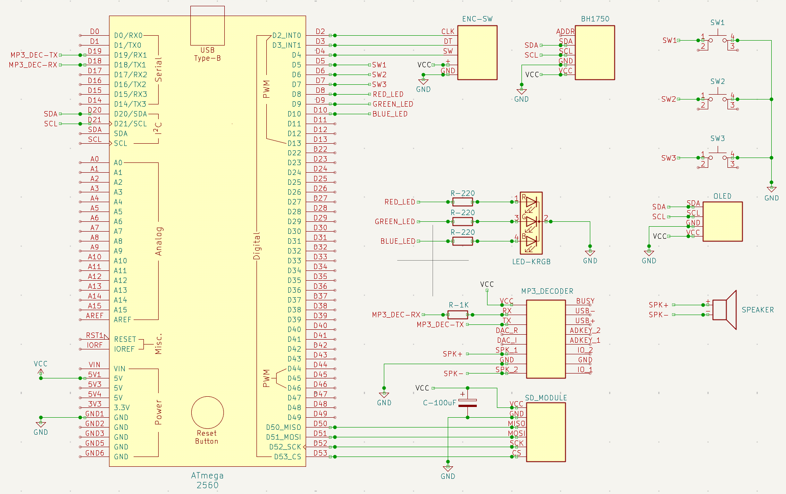

# AVR MP3 Player

**Author:** Necula Mihail

---

# Table of Contents

- [1. Introduction](#1-introduction)
- [2. General Description](#2-general-description)
- [3. Hardware Design](#3-hardware-design)
- [4. Software Design](#4-software-design)
- [5. Results Obtained](#5-results-obtained)
- [6. Conclusions](#6-conclusions)
- [7. Journal](#8-journal)
- [8. Bibliography](#9-bibliography)

---

## 1. Introduction

**What does it do?**

The project is an **MP3 player** based on the **AVR ATmega2560** architecture. It allows for **audio playback, track navigation and smart brightness adjustment** via an ambient light sensor.

Other key technical feature is the **multi-step speed control** (x0.5, x0.75, x1, x1.25, x1.5). Additionally, the system features **persistent memory**. Using a micro SD card, the device saves the current volume level and if the automate brighteness is active.

**What is its purpose?**

The goal is to provide a convenient, offline and distraction-free listening experience.

**What was the initial idea?**

The inspiration for this project was nostalgia for the dedicated MP3 player which I used during my childhood.

---

## 2. General description

### A. Block Diagram

### B. Hardware Modules Description

The hardware is divided into five main functional blocks:

* **Central Processing Unit (ATmega 2560):** Acts as the system "Master." It orchestrates all operations by managing the **I2C** bus for the display and light sensor, the **UART** interface for the MP3 module and **GPIO** pins for user inputs and status feedback.
* **User Interface & Sensing:**
  * **Light Sensor (GY-302 BH1750):** Communicates via **I2C** to provide lux values for the "Smart Brightness" feature.
  * **Rotary Encoder & Buttons:** Provide the primary user interface for navigation, volume control, speed control and playback commands.
* **Audio Subsystem:**
  * **MP3 Decoder (MP3 TF 16P):** Offloads the heavy task of MP3 processing from the MCU. Communicates with the MCU using **UART**.
  * **Audio MicroSD Card:** Stores the mp3 files.
  * **Speaker:** The final output transducer of the audio chain. It converts the received analog electrical signals into audible sound waves.
* **Storage Subsystem:**
  * **Metadata MicroSD Card:** Stores metadata about songs (name, duration, etc.).
  * **MicroSD Card Module:** Communicates via **SPI** with the MCU in order to provide information that the MP3-TF-16P cannot transmit back.
* **Visual Feedback:**
  * **1.3" OLED (SH1106):** Displays metadata and system status via **I2C**.
  * **Status RGB LED:** Provides immediate visual cues (e.g. playback state or errors) using **PWM**.

### C. Software Modules Description

The software is organized into the next main logical **modules** to ensure maintainability:

* **Playback Manager:** Controls the MP3-TF-16P decoder via UART. It handles playlist switching, track switching, play/pause states and implements speed control. The audio files are pre-encoded and uploaded manually at various speeds. For every conceptual playlist, the Audio MicroSD Card must store **five synchronized duplicate playlists** — one for each supported speed tier (x0.5, x0.75, x1, x1.25, x1.5). This module instantly switches playback speed without digital artifacts by shifting the decoder to the corresponding speed folder.
* **Metadata Manager:** Manages the SPI communication with the Metadata MicroSD Card. Unlike the audio storage, it maintains a **single master playlist reflecting the standard 1x playback profile**. When a new track is selected, it executes a lookup on this single index file to extract the static song name and base duration, eliminating data redundancy across speed changes.Moreover, it **persistently saves the device runtime configuration (volume, adaptive light state) into a dedicated file** on the card, automatically **restoring** these parameters upon device initialization.
* **Input Manager:** Implements a hybrid input strategy (Interrupts for rotation, Polling for buttons).
* **Display & UI Engine:** Manages OLED rendering and the RGB led.

---

## 3. Hardware Design

### A. Bill of Materials

| Component | Amount |
| :---: | :---: |
| MEGA 2560 Development Board (16U2) | 1 |
| MB-102 Breadboard (830 Points) | 2 |
| AC/DC Power Adapter  (5V, 2A, 5.5x2.5mm) | 1 |
| Female DC Barrel Jack to Screw Terminal Adapter | 1 |
| Tactile Switch Button (12x12x7.3mm) | 3 |
| Tactile Switch Cap (for 12x12x7.3mm button) | 3 |
| Encoder Module | 1 |
| 5-Pin Extra Tall Male Header - Straight | 1 |
| GY-302 Digital Light Sensor (BH1750, I2C) | 1 |
| 5mm Common Cathode RGB LED | 1 |
| 1.3" White OLED Display (SH1106, I2C) | 1 |
| MP3 TF 16P (UART) | 1 |
| Visaton K50 Speaker (50mm diameter, 8 Ω) | 1 |
| MicroSD Card Breakout Module (SPI) | 1 |
| 8GB MicroSD Card | 2 |
| 220 Ω Resistor (1/4 W) | 3 |
| 1 kΩ Resistor (1/4 W) | 1 |
| 100 μF Electrolytic Capacitor (25V) | 1 |
| Clipband | 1 |
| Heat-Resistant Kapton Tape | 1 |
| 10 cm Male-to-Male Jumper Wire | 38 |
| 10 cm Female-to-Male Jumper Wire | 7 |

### B. Electronic Schematic

### C. Pinout

#### Rotary Encoder

| Pin Component | Pin Arduino | Pin Microcontroller | Notes |
| :---: | :---: | :---: | :---: |
| CLK | D2 | PE4 | External Interrupt 4   (for rotation) |
| DT | D3 | PE5 | External Interrupt 5   (for direction) |
| SW | D4 | PG5 | Digital Input   (for click) |
| + | 5V | - | Power Supply |
| GND | GND | - | Ground |

#### Buttons

| Component | Pin Arduino | Pin Microcontroller | Notes |
| :---: | :---: | :---: | :---: |
| SW1 | D5 | PE3 | Digital Input |
| SW2 | D6 | PH3 | Digital Input |
| SW3 | D7 | PH4 | Digital Input |
| Common Ground | GND | - | Ground |

#### Light Sensor

| Pin Component | Pin Arduino | Pin Microcontroller | Notes |
| :---: | :---: | :---: | :---: |
| SCL | D21 | PD0 | I2C Clock |
| SDA | D20 | PD1 | I2C Data |
| VCC | 5V | - | Power Supply |
| GND | GND | - | Ground |

#### RGB LED (Common Cathode)

| Pin Component | Pin Arduino | Pin Microcontroller | Notes |
| :---: | :---: | :---: | :---: |
| Red | D8 | PH5 | PWM |
| Green | D9 | PH6 | PWM |
| Blue | D10 | PB4 | PWM |
| Cathode | GND | - | Ground |

#### OLED Display

| Pin Component | Pin Arduino | Pin Microcontroller | Notes |
| :---: | :---: | :---: | :---: |
| SCL | D21 | PD0 | I2C Clock |
| SDA | D20 | PD1 | I2C Data |
| VCC | 5V | - | Power Supply |
| GND | GND | - | Ground |

#### MP3 Decoder

| Pin Component | Pin Arduino | Pin Microcontroller | Notes |
| :---: | :---: | :---: | :---: |
| RX | D18 | PD3 | UART RX |
| TX | D19 | PD2 | UART TX |
| VCC | 5V | - | Power Supply |
| GND | GND | - | Ground |

#### MicroSD Card Module

| Pin Component | Pin Arduino | Pin Microcontroller | Notes |
| :---: | :---: | :---: | :---: |
| MISO | D50 | PB3 | SPI Master In Slave Out |
| MOSI | D51 | PB2 | SPI Master Out Slave In |
| SCK | D52 | PB1 | SPI Serial Clock |
| CS | D53 | PB0 | SPI Chip Select |
| VCC | 5V | - | Power Supply |
| GND | GND | - | Ground |

#### Speaker

| Pin Component | Pin MP3 Decoder |
| :---: | :---: |
| + (Positive) | SPK_1 |
| - (Negative) | SPK_2 |

### D. Support Components

This chapter details the additional hardware required to protect the main modules, stabilize the power supply and ensure reliable physical connections.

#### Resistors

| Value | Description |
| :---: | :---: |
| 220 Ω | **Current Limiting:** Protects the RGB LED from overcurrent. |
| 1 KΩ | **Logic Level Adaptation & Noise Suppression:** Placed in series with the MP3 decoder's RX pin. It limits current to safely interface the 5V logic of the ATmega 2560 with the 3.3V internal logic of the MP3-TF-16P, while absorbing digital switching spikes to eliminate audible hum and clicking noise. |
| 20-50 KΩ | **Internal Pull-ups:** Enabled in software for the Buttons and Encoder Switch to ensure a stable HIGH state when not pressed. |

#### Capacitors

| Type | Value | Description |
| :---: | :---: | :---: |
| Electrolytic | 100 μF | **Bulk Storage:** Electrolytic type is used for its high energy density. It acts as a reservoir to handle sudden power surges from the amplifier. Crucially, it stabilizes the VCC rail during high-current flash memory operations. Without it, transient voltage drops caused frequent corruption of the metadata microSD card, requiring files to be re-uploaded. |

#### Others

| Component | Description |
| :---: | :---: |
| Clipband | **I2C Connection Guard:** Placed directly under the BH1750 light sensor and tied to it. This ensures the module remains locked to the pins and prevents I2C bus crashes caused by physical movement. |
| Heat-Resistant Kapton Tape | **Contact Preservation:** Applied over the speaker terminals to keep the tied wires firmly in place against physical movement and vibrations, ensuring a stable and uninterrupted audio signal. |

---

## 4. Software Design

### A. Development Environment

The software for this project was developed and tested using:
* **VS Code:** Used as the text editor for the source code.
* **PlatformIO IDE:** Integrated within VS Code to compile the code and upload the binary directly to the ATmega2560 board.

### B. Used Libraries

* **SPI.h**  - handles hardware SPI communication with the Metadata MicroSD Card Module
* **SD.h** - provides file system functions to read song / pplaylist metadata and manage the configuration file (config.txt)
* **Wire.h** - manages I2C communication for both the OLED display and the ambient light sensor
* **U8g2lib** - used to drive the SH1106 OLED display for rendering text, menus, and UI components
* **BH1750:** - used to interface with the GY-302 digital light sensor to read ambient light values in lux
* **DFRobotDFPlayerMini** - handles the UART commands sent to the MP3-TF-16P decoder module for volume and playback control

### C. State Machine Architecture

The system workflow is modeled as a Finite State Machine (FSM) with **three states:**

* **STATE_SELECT_PLAYLIST:** The initial boot state. The OLED displays the available playlists stored on the MicroSD card.
* **STATE_SELECT_SONG:** Triggered after a playlist is selected. The module queries the card for the songs inside that specific folder and lists them on the screen.
* **STATE_SONG_SELECTED:** Triggered when playback begins. The screen renders audio metadata, an active progress bar, the current volume, the status of the playback (Play/Pause) and the selected speed.

### D. MicroSD Cards Storage Structure

The system utilizes two separate MicroSD cards, each formatted with a FAT32 file system:

#### Audio MicroSD Card

Since the MP3-TF-16P hardware module lacks native software control over audio playback speed, speed adjustments are implemented by duplicating the audio tracks into speed-specific folders. For **every single playlist** available in the system, **exactly 5 folders** must exist consecutively on the audio card (one for each speed tier: 0.50x, 0.75x, 1.00x, 1.25x, 1.50x). If there are $N$ playlists, the card will contain $5 \times N$ folders.

Below is an example showing how files are arranged:

* **ROOT**
  * 📁 **01** (Playlist 1 @ 0.50x Speed)
    * 📄 **001.mp3** (Track 1 slowed down to 0.50x)
    * 📄 **002.mp3** (Track 2 slowed down to 0.50x)
  * 📁 **02** (Playlist 1 @ 0.75x Speed)
    * 📄 **001.mp3** (Track 1 slowed down to 0.75x)
    * 📄 **002.mp3** (Track 2 slowed down to 0.75x)
  * 📁 **03** (Playlist 1 @ 1.00x Normal Speed)
    * 📄 **001.mp3** (Track 1 at normal speed)
    * 📄 **002.mp3** (Track 2 at normal speed)
  * 📁 **04** (Playlist 1 @ 1.25x Speed)
    * 📄 **001.mp3** (Track 1 sped up to 1.25x)
    * 📄 **002.mp3** (Track 2 sped up to 1.25x)
  * 📁 **05** (Playlist 1 @ 1.50x Speed)
    * 📄 **001.mp3** (Track 1 sped up to 1.50x)
    * 📄 **002.mp3** (Track 2 sped up to 1.50x)
  * 📁 **06** (Playlist 2 @ 0.50x Speed)
    * 📄 **001.mp3**
  * 📁 **07** (Playlist 2 @ 0.75x Speed)
    * 📄 **001.mp3**
  * 📁 **08** (Playlist 2 @ 1.00x Normal Speed)
    * 📄 **001.mp3**
  * 📁 **09** (Playlist 2 @ 1.25x Speed)
    * 📄 **001.mp3**
  * 📁 **10** (Playlist 2 @ 1.50x Speed)
    * 📄 **001.mp3**

#### Metadata MicroSD Card
To save storage space and **eliminate massive redundancy,** the metadata card does not duplicate text files for every speed tier. **It only tracks the base $N$ playlists.**

Below is an example showing how files are arranged:

* **ROOT**
  * 📄 **config.txt** (Configuration Metadata: Stores persistent volume and automate brightness states)
  * 📁 **01** (Metadata for Playlist 1 -> Maps dynamically to Audio Folders 01-05)
    * 📄 **000.txt** (Contains Playlist 1 Name)
    * 📄 **001.txt** (Contains Track 1 Name and Duration)
    * 📄 **002.txt** (Contains Track 2 Name and Duration)
  * 📁 **02** (Metadata for Playlist 2 -> Maps dynamically to Audio Folders 06-10)
    * 📄 **000.txt** (Contains Playlist 2 Name)
    * 📄 **001.txt** (Contains Track 1 Name and Duration)

**System Configuration File (config.txt):**
The content is formatted as a single continuous string containing exactly three numeric digits. The first two digits represent the persistent volume level, formatted as a fixed two-digit integer ranging from '00' (mute) to '30' (maximum volume). The third and final digit acts as a boolean flag for the automatic brightness state, where '0' indicates that the feature is disabled and '1' indicates that it is enabled.

**Content Example:**  
151

**Playlist Name File (000.txt):**
This file contains the static metadata for a playlist container. The data structure is restricted to a single line of text on the first line of the file, which holds the plain string representing the human-readable name of the specific playlist.

**Content Example:**  
Rock

**Track Metadata Files (001.txt, 002.txt, etc.):**
These files store the static metadata for individual audio tracks and are structured strictly across two separate lines of text to allow parsing by the MCU. The first line contains the plain text string representing the name of the song. The second line contains the exact runtime duration of the track, formatted strictly as 'MM:SS'.

**Content Example:**  
Choke me  
03:12

### E. User Interface Functional Mapping

| Input | Current State | Action / Functionality |
| :---: | :---: | :---: |
| **SW_1** | SELECT_PLAYLIST | Scrolls **UP** through the playlist list. |
| | SELECT_SONG | Scrolls **UP** through the song list. |
| | SONG_SELECTED | Skips to the **PREVIOUS** song. |
| **SW_3** | SELECT_PLAYLIST | Scrolls **DOWN** through the playlist list. |
| | SELECT_SONG | Scrolls **DOWN** through the song list. |
| | SONG_SELECTED | Skips to the **NEXT** song. |
| **SW_2** | SELECT_PLAYLIST | **OK:** Enters the selected playlist and loads its songs. |
| | SELECT_SONG | **OK:** Plays the selected song and enters the Player screen. |
| | SONG_SELECTED | **PLAY / PAUSE** |
| **ENC_SW** | SELECT_PLAYLIST | Toggles **Auto-Brightness** ON or OFF. |
| | SELECT_SONG | Toggles **Auto-Brightness** ON or OFF. |
| | SONG_SELECTED | Cycles through **Playback Speeds** (0.50x -> 0.75x -> 1.00x -> 1.25x -> 1.50x). |
| **SW_1** + **SW_2** | SELECT_SONG |  **BACK:** Returns to the Playlist Selection screen. |
| | SONG_SELECTED | **BACK:**  Stop the song and returns to the Song Selection screen. |
| **ENC_ROT Clockwise** | ANY STATE | **Volume UP** (Max 30) |
| **ENC_ROT Counter-CW** | ANY STATE | **Volume DOWN** (Min 0) |

### F. Input Strategy: Interrupts vs. Polling

A critical design choice was made to balance CPU responsiveness with input accuracy. The system distinguishes between high-speed dynamic signals and slow mechanical transitions.

* **Encoder Rotation (Hardware Interrupts):**
  * **Why interrupts?:** Fast rotation generates pulses in the millisecond range. If handled via polling, these pulses would be missed whenever the MCU is busy with I2C communication (OLED) or UART (Audio). Interrupts force the MCU to pause its current task and register every "click" of the rotation instantly.
  * **Debouncing:** To avoid using CPU-freezing delays during rotation tracking, we use a **5ms non-blocking lockout window**.

* **Tactile Buttons & Encoder Click (Software Polling):**
  * **High-Frequency Sampling:** Although handled via polling, the button is sampled thousands of times per second. Since a human press is very slow (100 - 250ms) compared to the MCU loop speed (< 10ms), it is impossible to miss a press.
  * **Why not interrupts?:** Polling is "cheaper" for the CPU. An interrupt forces a full context switch (saving registers, jumping to ISR), which is overkill for a slow button. Mechanical switches bounce violently. Using interrupts would force the MCU to stop and restart dozens of times for a single click, causing audio glitches or UI lag.
  * **Debouncing:** We use a **time-based lockout** to ensure a single clean press is registered: if (current_time - last_press_time > DEBOUNCE_THRESHOLD). This ensures that after the first detection, any subsequent bounces are ignored for **200ms,** while the MCU continues to drive the OLED and Audio without any freezing delays.

### G. Detection of buttons combinations

The polling loop injects a short **50ms stabilization delay** when SW1 or SW2 button is pressed to check if it is a combination of SW1 + SW2 to go to the previous menu.
* **Why is this necessary?:** From a mechanical and biological standpoint, it is **impossible** for a user **to depress two distinct tactile switches at the exact same microsecond**. One switch will always close slightly before the other. 
* **The Mechanism:** Without this 50ms window, the high-frequency sampling loop would immediately **register only the faster button** and execute its individual single-press action (e.g. scrolling up), completely missing the user's intent. The **50ms pause** freezes the execution state just long enough to allow the user's physical gesture to complete, After the delay, a clean **re-sampling of both GPIO pins** ensures that a genuine dual-input combo event is captured accurately without mistriggering single-button behaviors.

### G. Status RGB LED Signaling Logic

The RGB LED provides immediate visual feedback by indicating the **current menu state** (3 menus => 3 colours), using low-level **PWM** registers:

* **OCR4C** for Red
* **OCR2B** for Green
* **OCR2A** for Blue

### I. Calibration of Sensors

#### Digital Light Sensor (BH1750) and Auto-Brightness
The BH1750 sensor measures ambient light intensity in Lux and transmits the data to the MCU via the $I^2C$ bus. Calibration **limits** the raw input range strictly **between 0 and 1000 Lux** to filter out extreme spikes. This filtered value is then **scaled linearly to** a safe OLED **contrast range of [20, 255]** and sampled every **500 ms** to eliminate screen flickering.

#### Rotary Encoder as a Digital Position Sensor
The rotary encoder acts as an angular position sensor by translating physical mechanical rotation into digital pulses for the $INT4$ interrupt pin. To calibrate its hardware response, a strict **5 ms** software debouncing window filters out mechanical contact bouncing noise. The rotational direction is accurately resolved by **evaluating the logical state difference between the $CLK$ and $DT$ lines,** which are defaved by $90^\circ$ by design.

### J. Marquee (Scrolling Text) Visual Effect

To display long song and playlist names on the limited 128x64 OLED screen, a non-blocking marquee scrolling effect was implemented in software. 

* **Text Width Verification:** The system measures the length of the string. If the text exceeds a threshold, the scrolling routine is triggered. This only happens in the first two selection menus (Select Playlist and Select Songs).
* **Window Shifting:** Every **12 ms** (managed non-blocking via 'millis()'), the starting coordinate 'marqueeX' decrements, creating a smooth visual shift to the left. When a song is first selected, there is an initial wait delay of **1000 ms** before the text starts moving.
* **Looping:** When the end of the text reaches the right edge of the screen, the pointer resets back to the initial position, creating a continuous loop for clear readability.
* **Playback Truncation:** In the third menu in which a song is selected, the marquee effect is disabled. This means that long titles will be truncated to fit within the fixed screen boundaries.

---

## 5. Results Obtained

The letter **"A"** in the top-right corner of the Playlists and Songs menus signifies that the **Automatic Brightness** feature is active. It disappears when the feature is disabled. In the third menu, when a song is selected, the letter disappears regardless of whether the automatic brightness is ON or OFF.

**Select Playlist Menu**

 

**Select Song Menu**

 

**Selected Song Menu**

 
 

[Video Demo:](https://drive.google.com/file/d/1Ql3m_4e88D5WX5pUAxLVWdrxtVmwBFEr/view?usp=sharing) Please increase your device volume to hear the music properly, as it was recorded at a low volume at night.

---

## 6. Conclusions

Overall, this project was a **great hands-on experience** and I managed to build all of what I originally wanted. At first, I planned to use a VS1053 audio module, but it gave me too many problems:
* the SD card detection kept oscillating
* the music playback just would not work

Because of those hardware issues, I opted for the DFPlayer Mini combined with a dual SD card system, which worked out well.

---

## 7. Journal

* **24.04.2026:** Project Theme Selection and Approval
* **03.05.2026:** Components Order
* **05.05.2026:** Documentation Page Creation
* **15.05.2026:** Hardware Assembly Complete
* **18.05.2026:** Software Implementation Complete
* **19.05.2026:** Documentation Page Complete

---

## 8. Bibliografy

**Hardware**
* [ATmega2560 Datasheet](https://ww1.microchip.com/downloads/en/devicedoc/atmel-2549-8-bit-avr-microcontroller-atmega640-1280-1281-2560-2561_datasheet.pdf)
* [ATmega2560 Pinout](https://www.projehocam.com/wp-content/uploads/2021/02/Arduino-Mega-Pinout.jpg)
